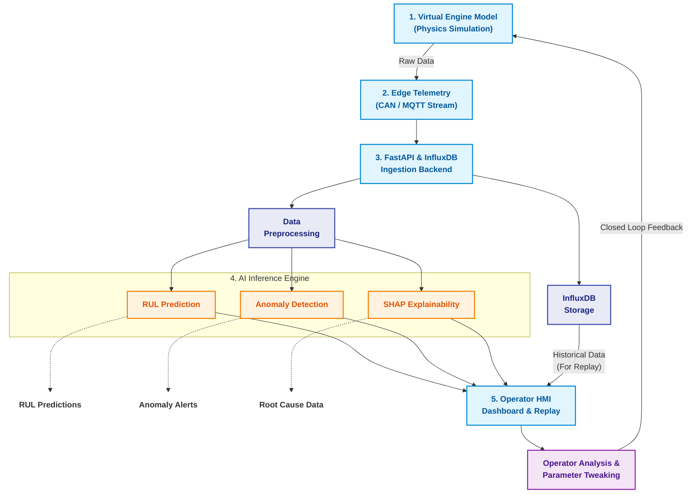

# AeroTwin (MALE UAV Digital Twin Framework)

Indigenous Digital Twin framework for aero-piston engines used in MALE UAV applications.
Developed for Smart India Hackathon 2026.

## Team
- **Rishik**: AI/ML Architect & Team Lead
- **Karan**: Predictive Data Scientist
- **Ninaad**: Simulation & Engine Modeler
- **SG**: Systems Architect & Backend Lead
- **Shama**: Telemetry & Edge Pipeline Engineer
- **Hansika**: Full-Stack & UI Developer

## Data Workflow Architecture
The system architecture follows a closed-loop digital twin model, integrating real-time physical simulation, edge telemetry, and deep learning diagnostics.

### Data Pipeline Flow
1. **Virtual Engine Model**: Physics simulation calculates real-time variables (RPM, CHT, EGT, vibration).
2. **Edge Telemetry**: Packages raw data into JSON and pushes it via MQTT/CAN to simulate UAV constraints.
3. **Backend Split**: Data is bifurcated into a **Cold Path** (InfluxDB for Mission Replay) and a **Hot Path** (Preprocessing for AI).
4. **AI Inference**: Preprocessed data enters multi-branch neural networks outputting RUL, Anomaly Alerts, and SHAP Root Causes.
5. **Operator HMI & Feedback Loop**: The dashboard visualizes the diagnostics. Operators can tweak parameters (e.g., lower throttle), which feeds back into the virtual engine to dynamically resolve issues.

## Quickstart
1. Spin up the infrastructure (MQTT + InfluxDB):
   `docker-compose up -d`
